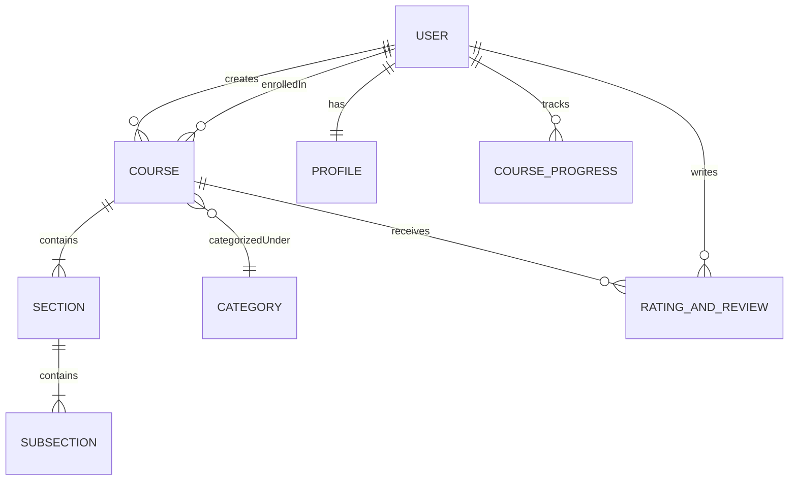

# 🎓 Study-Adda — Next-Gen EdTech Platform

[](https://react.dev/)
[](https://nodejs.org/)
[](https://www.mongodb.com/)
[](https://tailwindcss.com/)
[](https://razorpay.com/)
[](https://cloudinary.com/)

**Study-Adda** is a full-stack MERN (MongoDB, Express, React, Node.js) educational technology platform designed to deliver an interactive, seamless, and engaging learning experience for students and a comprehensive course creation and management suite for instructors.

---

## 📑 Table of Contents

- [Core Highlights](#-core-highlights)
- [Role-Based Features](#-role-based-features)
  - [👨‍🎓 Student Portal](#-student-portal)
  - [👨‍🏫 Instructor Studio](#-instructor-studio)
  - [🛡️ Security & Authentication](#️-security--authentication)
- [System Architecture & Data Models](#-system-architecture--data-models)
- [Tech Stack](#-tech-stack)
- [Project Directory Structure](#-project-directory-structure)
- [API Endpoints Overview](#-api-endpoints-overview)
- [Getting Started](#-getting-started)
  - [Prerequisites](#prerequisites)
  - [Environment Variables](#environment-variables)
  - [Installation](#installation)
  - [Running the Application](#running-the-application)
- [Authors & Acknowledgements](#-authors--acknowledgements)

---

## ✨ Core Highlights

- **Lightning-Fast Performance**: Client powered by **Vite** with sub-second HMR and optimized asset bundling.
- **Role-Based Access Control (RBAC)**: Distinct dashboards, workflows, and protected API routes for **Students**, **Instructors**, and **Admins**.
- **Hierarchical Course Curriculum**: Multi-level curriculum structure with Courses, Sections, and Sub-Sections (lectures with video streaming).
- **Integrated Payment Gateway**: Seamless payment flow with Razorpay, automated payment confirmation emails, and instant course enrollment.
- **Interactive Video Player**: Embedded course player with lecture progress tracking and completion state persistence.
- **Analytics & Insights**: Interactive visual charts (Chart.js) for instructors to track total students enrolled and revenue per course.
- **Modern Responsive UI**: Dark-themed, accessible UI engineered with custom Tailwind CSS palettes (`richblack`, `yellow`, etc.).

---

## 👥 Role-Based Features

### 👨‍🎓 Student Portal
- **Course Discovery**: Browse categorized catalog offerings, search courses, and inspect curriculum outlines, requirements, and instructor profiles.
- **Shopping Cart & Checkout**: Add multiple courses to cart with persistent local storage and pay via Razorpay.
- **Course Player & Tracking**:
  - Watch uploaded video lectures with embedded controls.
  - Mark lectures as completed/uncompleted with real-time progress bars.
- **Reviews & Ratings**: Post star ratings and detailed written feedback for completed courses.
- **Student Dashboard**: View all enrolled courses, overall completion percentages, and account settings.

### 👨‍🏫 Instructor Studio
- **3-Step Course Creation Wizard**:
  1. **Course Information**: Name, description, pricing, category, tags, thumbnail upload, and learning outcomes.
  2. **Curriculum Builder**: Add sections and nested subsections (video upload with duration, description, and title).
  3. **Publishing**: Toggle draft vs. public status.
- **Course Management**: Edit course content, update videos, view draft vs. published inventory, and delete courses.
- **Instructor Dashboard**: Visual analytics for total revenue generated, course-wise student enrollment numbers, and statistics.

### 🛡️ Security & Authentication
- **Secure Registration & Login**: Password hashing using `bcryptjs` and stateless authentication with JSON Web Tokens (JWT).
- **OTP Verification**: Email-based One-Time Password verification via Nodemailer on account registration.
- **Forgot & Reset Password**: Secure token-based password reset links sent via email.
- **Route Protection**: Client-side protected route guards (`OpenRoute`, `PrivateRoute`) and server-side authentication middleware (`auth`, `isStudent`, `isInstructor`, `isAdmin`).

---

## 🏛️ System Architecture & Data Models

The platform models relationships in MongoDB using Mongoose schemas:



- **`User`**: Role (`Student`, `Instructor`, `Admin`), credentials, references to enrolled courses and course progress.
- **`Profile`**: Personal info, bio, date of birth, contact number, and avatar image.
- **`Course`**: Title, description, instructor reference, pricing, thumbnail, tags, category, whatYouWillLearn, and sections array.
- **`Section` & `SubSection`**: Hierarchical curriculum units storing video URLs, title, description, and runtime duration.
- **`CourseProgress`**: Tracks completed lecture sub-sections for enrolled students.
- **`RatingAndReview`**: Star ratings (1–5) and student reviews tied to specific courses.
- **`Category`**: Course topics/domains (Web Dev, Android, Cloud, etc.).
- **`OTP`**: Temporary verification codes with automatic TTL expiry.

---

## 🛠️ Tech Stack

### Frontend (Client)
| Technology | Description |
|---|---|
| **React 18** | Modern UI component library |
| **Vite** | Next-generation build tool & dev server |
| **Redux Toolkit** | Global state management (auth, cart, course, profile, viewCourse) |
| **React Router v6** | Client-side routing and role-based guards |
| **Tailwind CSS** | Utility-first styling with custom dark theme design tokens |
| **React Hook Form** | High-performance form validation |
| **Chart.js & react-chartjs-2** | Visual charts and statistics |
| **Swiper** | Responsive course & review carousels |
| **Video-React** | Customizable video player component |
| **React Hot Toast** | Toast notification feedback |

### Backend (Server)
| Technology | Description |
|---|---|
| **Node.js & Express** | RESTful API server |
| **MongoDB & Mongoose** | NoSQL document database & ODM |
| **JWT (JSON Web Tokens)** | Stateless token-based authentication |
| **Bcrypt.js** | Password encryption and hashing |
| **Cloudinary** | Cloud storage for thumbnails and lecture videos |
| **Razorpay SDK** | Payment order capture and verification |
| **Nodemailer** | SMTP transactional email dispatch (OTP, invoices) |

---

## 📁 Project Directory Structure

```
studyadda/
├── index.html                 # Root entry HTML for Vite
├── vite.config.mjs            # Vite build & dev configuration
├── postcss.config.js          # PostCSS configuration for Tailwind CSS
├── tailwind.config.js         # Design system tokens and themes
├── package.json               # Client dependencies and orchestration scripts
├── .env                       # Client environment variables
├── public/                    # Static assets & icons
│
├── src/                       # Frontend Application
│   ├── App.jsx                # Main application route configurations
│   ├── index.jsx              # Application DOM bootstrap
│   ├── components/
│   │   ├── Common/            # Reusable UI (Navbar, Footer, Modal, RatingStars)
│   │   └── core/              # Feature modules (Auth, Dashboard, Course, ViewCourse, Catalog)
│   ├── pages/                 # Full-page views (Home, About, Contact, CourseDetails, Dashboard, etc.)
│   ├── slices/                # Redux Toolkit state slices
│   ├── reducer/               # Redux root reducer
│   ├── services/              # API connector and operations service layer
│   └── utils/                 # Constants, helpers, formatters
│
└── server/                    # Backend API
    ├── index.js               # Express application entry point
    ├── config/                # Database (Mongoose) & Cloudinary configuration
    ├── controllers/           # API controllers (Auth, Course, Payment, Profile, Section, etc.)
    ├── models/                # Mongoose database schemas
    ├── middleware/            # Auth verification & role guards
    ├── routes/                # Express router endpoints
    ├── mail/                  # Email HTML templates
    └── utils/                 # File uploader and email sender utilities
```

---

## 🔌 API Endpoints Overview

| Base Path | Description |
|---|---|
| `/api/v1/auth` | User registration, login, OTP dispatch, password reset |
| `/api/v1/profile` | Profile retrieval, update bio/avatar, instructor dashboard stats |
| `/api/v1/course` | Course CRUD, section/sub-section management, ratings, progress |
| `/api/v1/payment` | Razorpay order creation, payment signature verification |
| `/api/v1/reach` | Contact us feedback form submission |

---

## 🚀 Getting Started

### Prerequisites
- **Node.js**: v18.0.0 or higher (v20+ recommended)
- **MongoDB**: Local MongoDB instance or MongoDB Atlas cluster URI
- **Cloudinary Account**: Cloud name, API key, and secret for media storage
- **Razorpay Test Account**: Key ID and secret for checkout testing
- **Gmail/SMTP Credentials**: For OTP and notification dispatch

---

### Environment Variables

#### 1. Client Environment (`.env` in root)
```env
VITE_BASE_URL = http://localhost:4000/api/v1
```

#### 2. Server Environment (`server/.env`)
Create `server/.env` based on `server/.env.example`:
```env
PORT = 4000
MONGODB_URL = "mongodb+srv://<user>:<password>@cluster0.mongodb.net/studyAddaDB"
JWT_SECRET = "your_jwt_secret_key"

# Nodemailer / SMTP
MAIL_HOST = smtp.gmail.com
MAIL_USER = your_email@gmail.com
MAIL_PASS = your_google_app_password

# Razorpay
RAZORPAY_KEY = your_razorpay_key_id
RAZORPAY_SECRET = your_razorpay_secret

# Cloudinary
CLOUD_NAME = your_cloudinary_cloud_name
API_KEY = your_cloudinary_api_key
API_SECRET = your_cloudinary_api_secret
```

---

### Installation

1. **Install Client Dependencies**:
   ```bash
   npm install
   ```

2. **Install Server Dependencies**:
   ```bash
   cd server
   npm install
   cd ..
   ```

---

### Running the Application

- **Run both Client and Server concurrently**:
  ```bash
  npm run dev
  ```
  - Client opens at: `http://localhost:3000`
  - Server listens at: `http://localhost:4000`

- **Run Client Only**:
  ```bash
  npm start
  ```

- **Run Server Only**:
  ```bash
  npm run server
  ```

- **Build Client for Production**:
  ```bash
  npm run build
  ```

---

## 👨‍💻 Authors & Acknowledgements

- **Vikas Pandey** — Creator & Developer
- Inspired by the CodeHelp EdTech architectural design (Instructor: **Love Babbar**)
